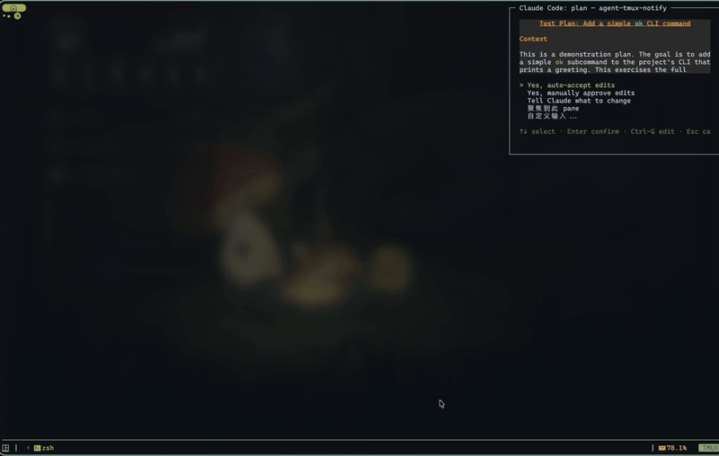

# agent-tmux-notify

[English](README.md) | **中文**

在 tmux 中监控 Claude Code CLI 实例，当需要用户输入时自动弹出交互窗口。

## 效果展示

### 权限请求

<p align="center">
  
</p>

### Plan 审批

<p align="center">
  
</p>

## 功能

- **自动发现**：启动时扫描所有 tmux pane，绑定正在运行的 Claude Code 进程（PID）
- **Hook 驱动主流程**：接收 Claude Code hooks 推送的 `PreToolUse`、`PermissionRequest`、`Notification` 等事件，直接触发弹窗并将用户决策回传给 Claude Code
- **Buffer 辅助解析**：仅在需要时读取 tmux buffer 尾部内容，用于补全选项列表与当前选中项
- **弹窗交互**：检测到需要输入时，在当前 pane 旁弹出 curses TUI，展示上下文、问题和选项
- **Plan 文件读取**：Plan 审批场景自动从 `~/.claude/plans/` 读取 plan 文件内容，在弹窗中渲染完整 Plan
- **Idle 通知**：Claude Code 空闲等待输入时弹出通知，可一键聚焦到对应 pane
- **Rich Markdown 渲染**：弹窗上下文使用 rich 库渲染 markdown，支持语法高亮
- **可配置解析规则**：权限与 Plan 场景解析规则（正则 + 关键词）可在配置文件中自定义
- **聚焦跳转**：弹窗中可选择直接跳转到对应 pane
- **macOS 服务**：提供 launchd 服务配置，支持开机自启和后台运行

## 安装

### Homebrew（通过 tap）

```bash
brew tap xbunax/tap
brew install xbunax/tap/agent-tmux-notify
```

### 源码安装

需要 Python 3.13+ 和 [uv](https://github.com/astral-sh/uv)。

```bash
git clone <repo>
cd agent-tmux-notify
```

### 一键安装（推荐）

使用 `service.sh` 脚本完成 CLI 工具安装、配置文件部署和 launchd 服务注册：

```bash
./service.sh install
```

这会：
1. 通过 `uv tool install` 将 `agent-tmux-notify` 安装为全局 CLI 命令
2. 将 `config.toml.default` 复制到 `~/.config/agent-tmux-notify/config.toml`（已存在时可选覆盖或 diff）
3. 注册 macOS LaunchAgent，支持后续通过 `service.sh` 管理服务

### 手动安装

```bash
uv sync                    # 仅开发模式
uv tool install -e .       # 安装为全局 CLI
```

### 配置 Claude Code Hooks（推荐）

一键将 hook 配置写入 `~/.claude/settings.json`，让 Claude Code 主动推送事件：

```bash
agent-tmux-notify --setup-hooks
```

这会为 `PreToolUse`、`PermissionRequest`、`Notification`、`Stop` 四个事件注册 HTTP hook，指向本地 `127.0.0.1:19836`。已有的 hooks 配置不会被覆盖。

## 使用

```
agent-tmux-notify [选项]

选项：
  --discovery-interval FLOAT  pane 发现扫描间隔，秒（默认 30）
  --config PATH               配置文件路径（默认 ~/.config/agent-tmux-notify/config.toml）
  --hook-port INT             Hook 服务器端口（默认 19836）
  --no-hook-server            禁用 Hook HTTP 服务器
  --setup-hooks               配置 Claude Code hooks 后退出
  --dump-hook-payloads        将 hook 原始 payload 写入 JSONL（调试）
  --dump-path PATH            hook payload dump 文件路径（默认 /tmp/claude-code-hook-payloads.jsonl）
  -v, --verbose               开启 debug 日志
```

开启详细日志：

```bash
agent-tmux-notify -v
```

### 服务管理

通过 `service.sh` 管理 macOS launchd 后台服务：

```bash
./service.sh start      # 启动服务
./service.sh stop       # 停止服务
./service.sh restart    # 重启服务
./service.sh status     # 查看服务状态
./service.sh logs       # 查看日志（tail -f）
./service.sh uninstall  # 卸载服务
```

日志路径：`~/Library/Logs/agent-tmux-notify/`

## 弹窗操作

| 按键 | 动作 |
|------|------|
| `↑` / `↓` | 移动选择 |
| `Enter` | 确认选项 |
| `1`–`9` | 数字快选（对应 Claude Code 的选项编号） |
| `Ctrl-G` | 编辑 Plan 文件（仅 plan 场景） |
| `Esc` | 取消，关闭弹窗 |

选项列表末尾固定追加两个特殊选项：
- **[聚焦到此 pane]**：切换 tmux 焦点到对应的 Claude Code pane
- **[自定义输入...]**：进入文本输入模式，发送任意内容（idle 场景下不显示）

## 配置

配置文件位于 `~/.config/agent-tmux-notify/config.toml`，所有字段均可选，缺省时使用内置默认值。默认配置模板见 `config.toml.default`。

### 全局设置

```toml
# 缓冲区捕获行数
buffer_lines = 25
```

### 弹窗位置

```toml
[popup]
width  = "25%"
height = "25%"
x      = "R"    # R = 右侧，C = 居中，或像素值
y      = "0"    # 0 = 顶部，或像素值
```

### Hook 服务器

```toml
[hook_server]
enabled        = true         # 是否启用 hook HTTP 服务器
host           = "127.0.0.1"
port           = 19836
ttl            = 30.0         # hook 事件过期时间，秒
dump_payloads  = false        # 是否将 hook 原始 payload 写入文件（调试用）
dump_path      = "/tmp/claude-code-hook-payloads.jsonl"
```

### 解析规则配置

每个场景支持 `patterns`（正则）和 `keywords`（子串匹配）两种方式，任意一种命中即将该行标记为解析起点。

```toml
[parse_rules.permission]
patterns = ['Do you want to .*\?', 'Would you like to .*\?']
keywords = ["Do you want to", "Would you like to"]

[parse_rules.plan]
keywords = ["approve this plan", "approve the plan"]
```

> TOML 中正则建议使用单引号（literal string），避免反斜杠转义问题。

### 触发场景说明

| 场景 | 触发时机 | 弹窗行为 |
|------|----------|----------|
| `permission` | Claude Code 申请执行权限 | 展示工具调用内容，等待确认（hook 模式下决策直接回传） |
| `plan` | Claude Code 提交 Plan 等待审批 | 展示 Plan 摘要，支持 Ctrl-G 编辑后重新审批 |
| `idle` | Claude Code 空闲等待用户输入 | 通知弹窗，可一键聚焦到对应 pane |

## 架构

```
agent_tmux_notify/
  cli.py               CLI 入口，解析参数，启动 Monitor
  monitor.py           主循环：发现、hook 处理、弹窗调度
  detector.py          buffer 辅助选项解析、TriggerEvent/HookData、Plan 文件读取
  hook_server.py       HTTP hook 服务器：HookServer、HookStore、PaneCorrelator
  setup_hooks.py       CLI 工具：配置 ~/.claude/settings.json 中的 hooks
  config.py            TOML 配置加载：PopupConfig、HookServerConfig、ParseRulesConfig
  popup.py             curses TUI 弹窗，rich markdown 渲染
  tmux.py              tmux CLI 异步封装
main.py                旧入口（兼容），等同于 cli.py
config.toml.default    默认配置模板
service.sh             macOS launchd 服务管理脚本（install 时动态生成 plist）
```

### 数据流

```
Claude Code ──[hook HTTP POST]──► HookServer (localhost:19836)
    │                                  │
    │                          ┌───────┴───────┐
    │                          ▼               ▼
    │                    PreToolUse        PermissionRequest / Notification
    │                    (缓存上下文)       (直接触发弹窗)
    │                          │               │
    │                          └───────┬───────┘
    │                                  ▼
    │                        PaneCorrelator (CWD 匹配 hook → pane)
    │                                  │
    └──[tmux buffer (辅助)]──► detector.extract_options_from_buffer()
                                       │
                                       ▼
                            TriggerEvent → popup.py (rich markdown)
                                       │
                                       ▼
                            决策回传 HookServer (JSON response)
```

### TriggerEvent JSON 结构

弹窗通过临时 JSON 文件接收数据：

```json
{
  "project_name": "my-project",
  "session_name": "main",
  "pane_id": "main:0.1",
  "scenario": "permission",
  "content": ["Bash command", "  ls -la ~/.claude/"],
  "question": "Do you want to proceed?",
  "options": ["Yes", "No, and tell Claude what to do differently"],
  "selected_index": 0,
  "hook_data": {
    "session_id": "abc123",
    "hook_event_name": "PermissionRequest",
    "tool_name": "Bash",
    "tool_input": {"command": "ls -la ~/.claude/"},
    "cwd": "/Users/user/my-project"
  }
}
```

`hook_data` 在 hook 服务器未启用或未匹配到事件时为 `null`。
